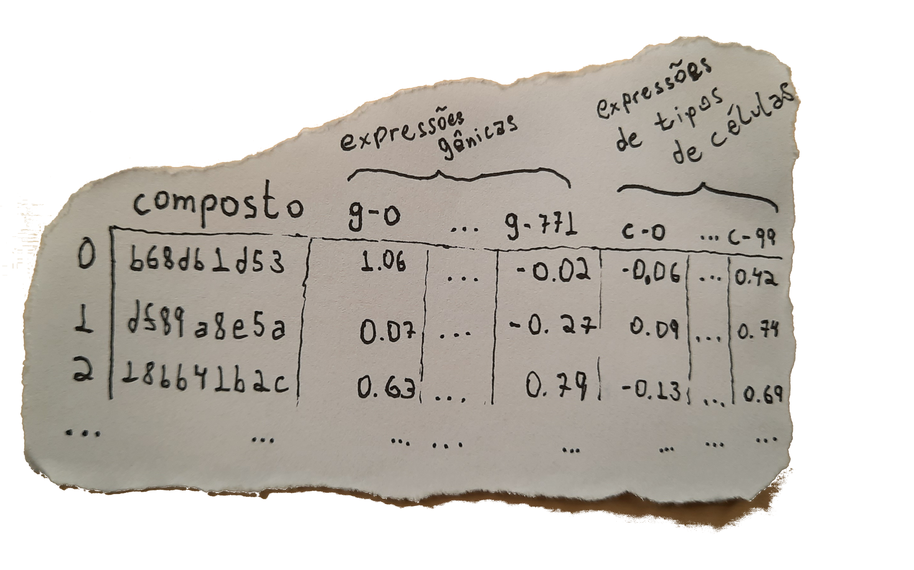

# Modelando Mecanismos de Ação de Compostos

#### Desafio Final Imersão Dados 💻 Alura 💜

## Introdução 📖

## O Projeto 📚
### Hipóteses

 &nbsp; &nbsp; &nbsp; A ideia por trás do projeto era encontrar grupos dos conjuntos de dados com uma alta correlação, para assim modelar a inferência de um grupo dado o outro. 

&nbsp;

 &nbsp; &nbsp; &nbsp; Realizando diversos testes, surgiram evidências fortes que certos indicadores de expressões gênicas e de tipos de células aparentemente apresentavam  alta correlação uns com os outros (proporcional ou inversamente proporcional), como até mesmo os professores mostraram nas aulas.

&nbsp;

 &nbsp; &nbsp; &nbsp; Partindo desta hipótese, elaborei com o apoio da <b><a href="https://sklearn.org/">biblioteca scikit-learn</a></b> um modelo baseado em Redes Neurais que prevesse resposta de certas expressões a partir de outras. Contudo, mesmo usando ferramentas para melhorar a performance do modelo com a busca de hiperparâmetros mais adequados ao problema, a acurácia não foi satisfatória, ficando na casa dos 60% no conjunto de teste, com resultados muito sensíveis a <i>overfitting</i>.

&nbsp;

 &nbsp; &nbsp; &nbsp; Em seguida, explorei os dados relacionados aos mecanismos de ação dos compostos em proteínas alvo, do conjunto de dados de resultados. Por se tratarem de valores inteiros, pude modelar um classificador com a ferramenta de Árvore de Decisão.

&nbsp;

 &nbsp; &nbsp; &nbsp; O modelo é treinado para cada uma das proteínas alvo, usando como classes para o classificados os diferentes mecanismos de ação envolvidos. O algoritmo treina três modelos simultaneamente: o primeiro usa como entrada apenas as expressões gênicas; já segundo modelo é treinado com as expressões dos tipos de células; e, por fim, o último modelo é treinado com os dois tipos de expressões do conjunto de dados.

&nbsp;

 &nbsp; &nbsp; &nbsp; Os modelos elaborados dessa forma obtiveram uma altíssima acuracia, tanto na fase de treinamento quanto na de teste, com resultados de acurácia raramente abaixo de 95%.

&nbsp;

 &nbsp; &nbsp; &nbsp; Para concluir o projeto, exibo um DataFrame que mostra os compostos envolvidos nos mecanimos de ação registrados. Assim, espero, ajudando a enteder o caminho entre o mecanismo de ação dos compostos, as alterações nas expressões gênicas e em diferentes tipos de células, e a relação destes mecanismos de ação com outros compostos do conjunto de dados.

&nbsp;

- Apresente o objetivo do projeto;
Objetivo:

 &nbsp; &nbsp; &nbsp; Elaborar um modelo que, selecionado uma proteína alvo presente no conjunto de dados, possa responder com uma lista de expressões gênicas (de "g-0" a "g-771") e/ou expressões dos tipos de células (de "c-0" a "c-99") que desperte diferentes mecanismos de ação. 

- Evidencie as particularidades do projeto;

- Explique sobre a estrutura dos dados;
- Exiba os links utilizados para a conclusão do projeto
