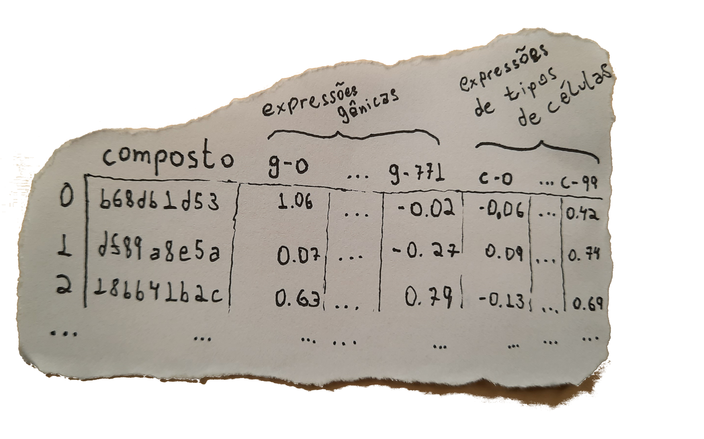
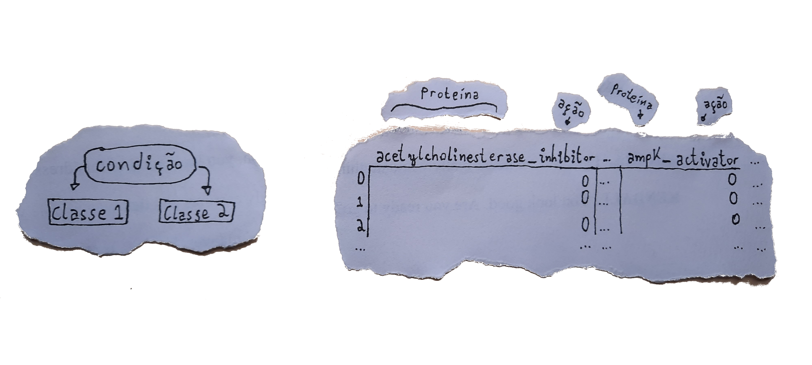
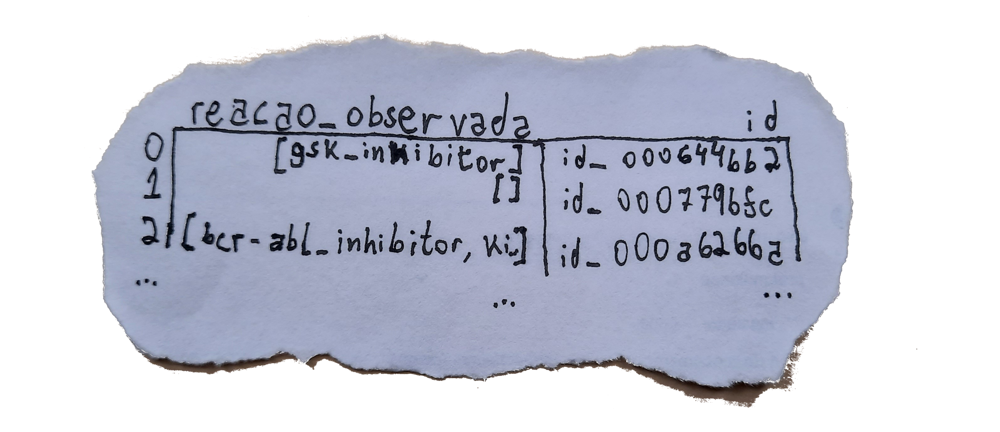
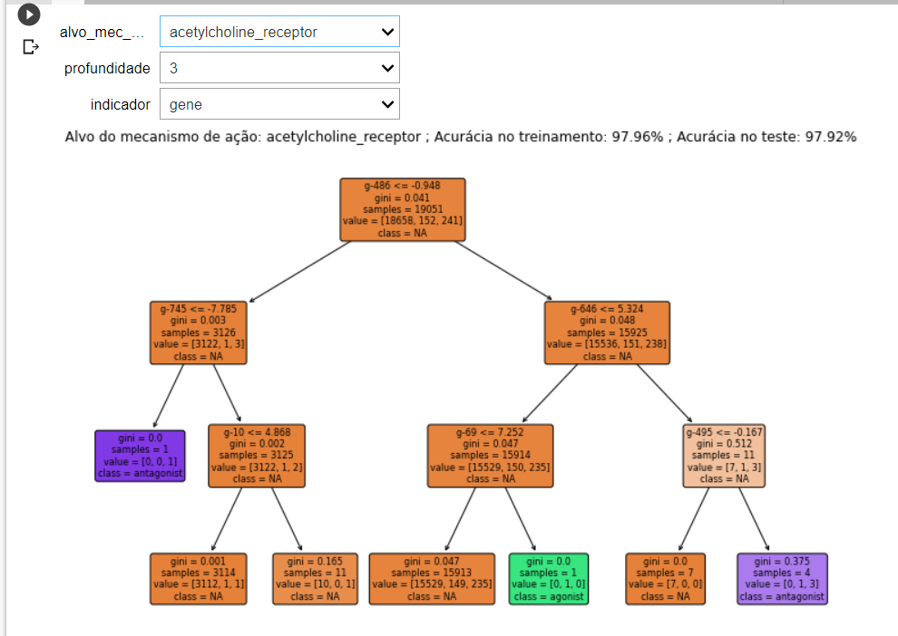
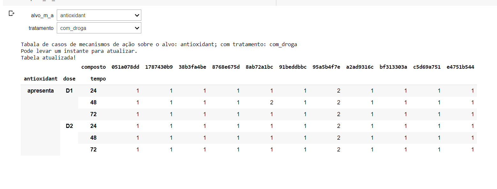

      

# Modelando Mecanismos de Ação de Compostos
#### Desafio Final Imersão Dados 3 💻 Alura 💜

## Introdução 📖

 &nbsp; &nbsp; &nbsp; Este trabalho demonstra os resultados da análise de um conjunto de dados de <i>Drug discovery</i>, tema da 3ª Imersão de Dados da Alura. O conjunto de dados integra o desafio <a href="https://www.kaggle.com/c/lish-moa"><i>Mechanisms of Action (MoA) Prediction</i></a>, proposto no <a href="https://www.kaggle.com/"><i>kaggle</i></a> como parte do projeto <a href="https://clue.io/"><i>ConnectivityMap</i></a>, onde é proposta à comunidade a busca por correlações relevantes que ajudem na previsão do comportamento dos mecanismos de ação para a classificação de drogas.

&nbsp;

## O Projeto 📚

### Objetivo

 &nbsp; &nbsp; &nbsp; Elaborar um modelo que, selecionado uma proteína alvo presente no conjunto de dados, possa responder com uma lista de expressões gênicas (de <code>g-0</code> a <code>g-771</code>) e/ou expressões dos tipos de células (de <code>c-0</code> a <code>c-99</code>) que desperte diferentes mecanismos de ação sobre a proteína em questão. 

### Hipóteses

 &nbsp; &nbsp; &nbsp; A ideia por trás do projeto era encontrar grupos dos conjuntos de dados com uma alta correlação, para assim modelar a inferência de um grupo dado o outro. 

&nbsp;

 &nbsp; &nbsp; &nbsp; Realizando diversos testes, surgiram evidências fortes que certos indicadores de expressões gênicas e de tipos de células aparentemente apresentavam  alta correlação uns com os outros (proporcional ou inversamente proporcional), como até mesmo os professores mostraram nas aulas.

&nbsp;

 &nbsp; &nbsp; &nbsp; Partindo desta hipótese, elaborei com o apoio da <b><a href="https://sklearn.org/">biblioteca scikit-learn</a></b> um modelo baseado em Redes Neurais que prevesse resposta de certas expressões a partir de outras. Contudo, mesmo usando ferramentas para melhorar a performance do modelo com a busca de hiperparâmetros mais adequados ao problema, a acurácia não foi satisfatória, ficando na casa dos 60% no conjunto de teste, com resultados muito sensíveis a <i>overfitting</i>.

&nbsp;

 &nbsp; &nbsp; &nbsp; Em seguida, explorei os dados relacionados aos mecanismos de ação dos compostos em proteínas alvo, do conjunto de dados de resultados. Por se tratarem de valores inteiros, pude modelar um classificador com a ferramenta de Árvore de Decisão.

&nbsp;

### Estrutura

 &nbsp; &nbsp; &nbsp; O modelo é treinado para cada uma das proteínas alvo, usando como classes para o classificados os diferentes mecanismos de ação envolvidos. O algoritmo treina três modelos simultaneamente: o primeiro usa como entrada apenas as expressões gênicas; já segundo modelo é treinado com as expressões dos tipos de células; e, por fim, o último modelo é treinado com os dois tipos de expressões do conjunto de dados.

&nbsp;

 &nbsp; &nbsp; &nbsp; Para esta modelagem tratei os dados do conjunto de resultados dos experimentos, de forma a alocar os mecanismos de ações em uma única coluna para cada <code>id</code> registrado, conforme abaixo. 

&nbsp;

 &nbsp; &nbsp; &nbsp; Os modelos elaborados dessa forma obtiveram uma altíssima acuracia, tanto na fase de treinamento quanto na de teste, com resultados de acurácia raramente abaixo de 95%.

&nbsp;

 &nbsp; &nbsp; &nbsp; Para concluir o projeto, exibo um DataFrame que mostra os compostos envolvidos nos mecanimos de ação registrados. Assim, espero, ajudando a enteder o caminho entre o mecanismo de ação dos compostos, as alterações nas expressões gênicas e em diferentes tipos de células, e a relação destes mecanismos de ação com outros compostos do conjunto de dados.

&nbsp;

### Conclusão

 &nbsp; &nbsp; &nbsp; Com os resultados apresentados, concluo que:

1. A modelagem dos dados com Árvore de Decisão é promissora para a classificação dos mecanismos de ação dos compostos em proteínas, apresentando uma acurácia próxima à 100%.
2. Tanto os indicadores das expressões gênicas, quanto as expressões dos tipos de células são excelentes parâmentros para a classificação e previsão dos mecanismos de ação em proteínas.
3. Para trabalhos futuros, sugiro o uso de maior poder computacional para explorar hiperparâmetros do modelo de Árvore de Decisão, para assim minimizar os indicadores de expressão necessários para a classificação correta do conjunto de dados.

 &nbsp; &nbsp; &nbsp; Fico extremamente grato por todo o material disponibilizado e pela atenção dos professores na elaboração da imersão. 💜

